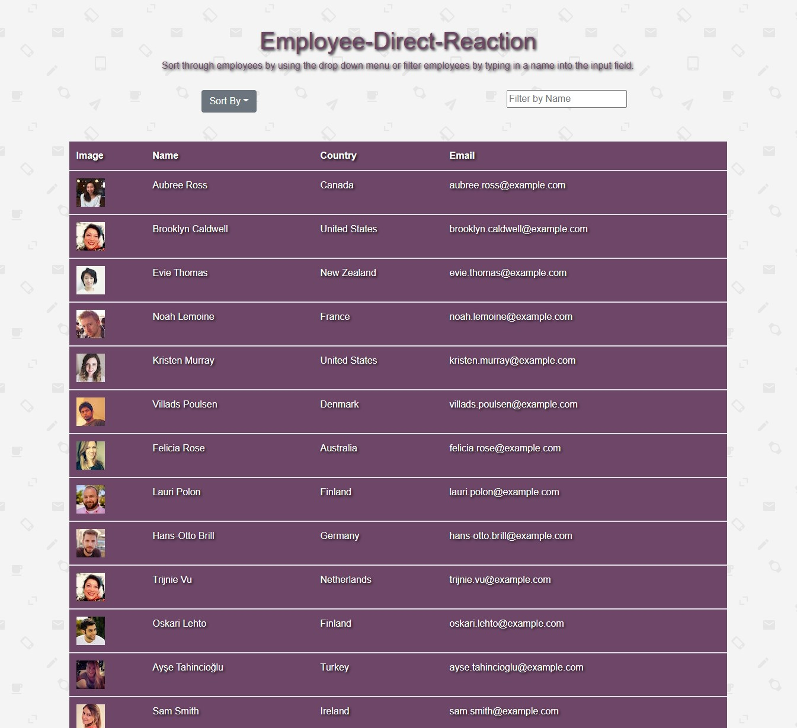

# employee-direct-reaction

## Description

A React app that renders a table of random employees that can be sorted by name, country, or email  alphabetically or filter employees by name.

## Demo

## Deployment

## Table of Contents

* [Installation](#installation)

* [Usage](#usage)

* [Credits](#credits)

* [License](#license)

## Installation

Once the repository is cloned run "npm i" to install dependenies then "npm start" to run the application.

## Usage

There are no special requirements for using this repo

## Credits

Alex Shafer

## License

MIT

## Tests

no test currently implimented

## Questions

